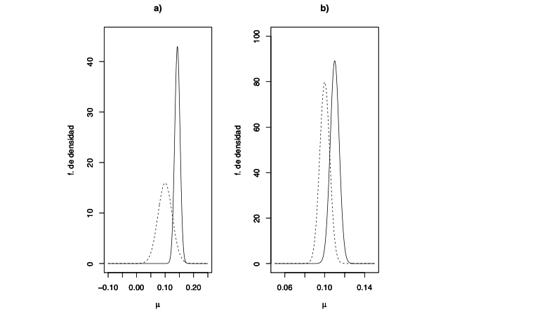
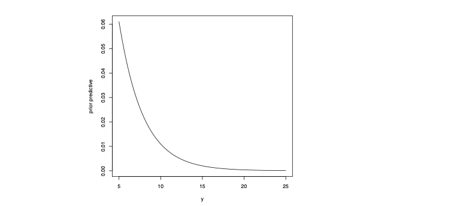

### distribución *a posteriori*, distribución *a priori*


En los dos ejemplos anteriores se han presentado los elementos básicos de la inferencia bayesiana. Por un lado tenemos los parámetros $\theta$ que representan las magnitudes desconocidas que son nuestro objeto de interés. En los ejemplos anteriores el parámetro de interés es unidimensional, pero en general será multidimensional. Además, veremos más adelante que también habrá parámetros en los que no estamos directamente interesados, pero cuya existencia tenemos que gestionar.


La información (mucha, poca o incluso ninguna) sobre estos parámetros antes de obtener información experimental está contenida en la función $p(\theta)$: la función de masa $p(\theta)$ en la Tabla [1](03_Bayes_variables_aleatorias_discretas.md#tabla-1) del ejemplo [2](03_Bayes_variables_aleatorias_discretas.md#ejemplo-2) y la función de densidad $p(\theta)$ en la ecuación [3](04_Bayes_variables_continuas.md#3). A estas distribuciones se las conoce como distribuciones a priori, destacando que esta asignación inicial se corresponde con la información sobre los parámetros desconocidos disponible sin tener en cuenta la información muestral.


Además tenemos un experimento que nos proporcionará conocimiento sobre $\theta$ por medio de la observación de Y. El vínculo entre ambas cantidades Y y $\theta$ está contenido en la distribución de probabilidad de Y condicionada a que sabemos el valor de $\theta: p(y | \theta)$. Esta distribución se corresponde con el modelo asumido para Y (Poisson en el ejemplo  [2](03_Bayes_variables_aleatorias_discretas.md#ejemplo-2) y exponencial en el ejemplo  [3](04_Bayes_variables_continuas.md#ejemplo-3)). Si vemos esta función como una función de los parámetros, obtenemos un elemento crucial en el ámbito de la estadística: la función de verosimilitud o *likelihood function* en inglés. Es bastante frecuente simbolizar esta función como $L(\theta,y)$. Más adelante indicaremos cómo asignar modelos y por tanto veremos la forma de las funciones de verosimilitud en situaciones concretas.


El aspecto particular del método bayesiano es actualizar la información sobre $\theta$ una vez conocidos los datos $y$ y por tanto sabemos el valor adoptado por la variable aleatoria $Y = y$ (en el ejemplo [2](03_Bayes_variables_aleatorias_discretas.md#ejemplo-2) observamos 5 desperfectos, $Y = 5$, mientras que en el ejemplo [3](04_Bayes_variables_continuas.md#3) observamos $Y = 21.75$). El objeto matemático que contiene esta actualización es la distribución condicional $p(\theta | y)$ que, como ya hemos visto, se obtiene en virtud del teorema de Bayes como:

$$
p(\theta | y) = \frac{p(y | \theta)p(\theta)}{p(y)}.
$$

A esta distribución condicional se le llama distribución _a posteriori_ y se corresponde con la actualización de la distribución para $\theta$ incluyendo la información en los datos. Las distribuciones _a posteriori_ de los ejemplos anteriores están en la Tabla [2](03_Bayes_variables_aleatorias_discretas.md#ejemplo-2) en el ejemplo [2](03_Bayes_variables_aleatorias_discretas.md#ejemplo-2) y en la ecuación [4](04_Bayes_variables_continuas.md#4) en el ejemplo [3](04_Bayes_variables_continuas.md#3).

En el mundo bayesiano es bastante común que, en las distribuciones sobre los parámetros, se emplee la letra griega $\pi$ y por tanto se escriba $\pi(\theta)$ (para la distribución _a priori_) y $\pi(\theta | y)$ (distribución _a posteriori_, condicional a $Y = y$). No obstante, aquí optaremos por la notación $p$, para ser consistentes con el resto de los materiales del curso.

Ya hemos visto que en el manejo de las distribuciones sobre los parámetros es bastante habitual encontrarnos con constantes de proporcionalidad. Las constantes de proporcionalidad están definidas por la obligación de la correspondiente distribución de probabilidad de integrar uno y por tanto su valor está implícitamente determinado por los factores que dependen de $\theta$. Esta observación permite avanzar en los cálculos sin especificar explícitamente su valor haciendo por tanto las matemáticas menos engorrosas. Esto se consigue introduciendo las funciones de probabilidad condicional es el símbolo $\propto$ de "proporcional a" con lo que el teorema de Bayes queda:

$$
p(\theta | y) \propto p(y | \theta)p(\theta),
$$

o introduciendo la noción de función de verosimilitud como:

$$
p(\theta | y) \propto L(\theta,y)p(\theta).
$$

En la anterior ecuación "la distribución _a posteriori_ es proporcional al producto de la verosimilitud y la distribución _a priori_" es, de alguna forma, la _piedra filosofal_ de la aproximación bayesiana.

Mantener los cálculos al nivel de "proporcional a" es incluso muy útil en la distribución _a priori_, ya que la constante de integración de la distribución _a priori_ "desaparece" en la distribución _a posteriori_. Quizás pasó desapercibido, pero ya hemos visto esta desaparición en el ejemplo [3](04_Bayes_variables_continuas.md#3) observa que en el hilo de ecuaciones en [4](04_Bayes_variables_continuas.md#4) la constante de proporcionalidad de la distribución _a priori_, $C_1$, cancela en el numerador y el denominador.

En general, la forma de operar es sencilla, pero merece la pena que la practiquemos con otro ejemplo en el que repasaremos todos los ingredientes presentados hasta ahora.

<br>

##### Ejemplo 4

Supongamos que estamos interesados en un parámetro desconocido $\mu$, cuya interpretación es la de una media poblacional (por ejemplo podemos pensar que $\mu$ es el rendimiento medio de un índice bursátil). La información disponible sobre $\mu$ nos lleva a asignar la siguiente distribución _a priori_:

$$
p(\mu) = \text{normal}(\mu | \mu_y, \sigma_y),
$$

es decir, una distribución normal de media $\mu_y$ y de desviación típica $\sigma_y$. Es bastante creíble que hayamos llegado a esta asignación usando datos históricos sobre la media de índices (rendimientos del índice). Usando la forma de la densidad normal, podemos escribir:

$$
p(\mu) = \frac{1}{\sigma_y \sqrt{2\pi}} \exp\left( -\frac{1}{2\sigma_y^2} (\mu - \mu_y)^2 \right),
$$

o alternativamente:

$$
p(\mu) \propto \exp\left( -\frac{1}{2\sigma_y^2} (\mu - \mu_y)^2 \right).
$$

En este caso, el espacio paramétrico de $\mu$ es $\mathbb{R}$.

Para aprender (más) sobre este parámetro, "diseñamos" un experimento en el que obtendremos información de $\mu$. En nuestro caso, vamos a observar una medición $Y$ que en el contexto del activo financiero puede ser el rendimiento que se observará mañana. Asumimos que la distribución de $Y$, condicional a $\mu$, es también normal, en este caso una normal de media $\mu$ y de desviación típica 0.01:

$$
p(Y | \mu) = \text{normal}(Y | \mu, 0.01).
$$

---

Este es el “modelo” observacional asumido que conecta el experimento con el parámetro desconocido $\mu$ que define la función de verosimilitud:

$$
L(\mu;y) = \text{normal}(y | \mu,0.01) = \frac{1}{0.01 \cdot \sqrt{2\pi}} \exp\left( -\frac{1}{2 \cdot 0.01^2}(y - \mu)^2 \right).
$$

Con todo esto, la distribución _a posteriori_ es la distribución de $\mu$ condicionada a que $Y$ ha tomado el valor $y$:

$$
p(\mu | y) \propto L(\mu;y)p(\mu),
$$

por tanto:

$$
p(\mu | y) \propto \exp\left( -\frac{1}{2 \cdot 0.01^2}(y - \mu)^2 \right) \exp\left( -\frac{1}{2\sigma_y^2} (\mu - \mu_y)^2 \right).
$$

La expresión anterior define implícitamente la distribución _a posteriori_. No obstante, para obtener conclusiones a partir de esta, nos va a ser útil conocer cuál es su forma exacta. Como estamos identificando una función de densidad para $\mu$, las constantes multiplicativas que no dependan de $\mu$ las podemos obviar. Esta observación, junto con el desarrollo de cuadrados en las exponenciales nos lleva a la siguiente expresión:

$$
\begin{align*}
p(\mu | y) &\propto \exp \left( -\frac{1}{2} \left[ \frac{(y - \mu)^2}{0.01^2} + \frac{(\mu - \mu_y)^2}{\sigma_y^2} \right] \right) \\
&\propto \exp \left( -\frac{1}{2} \left[ \frac{\mu^2}{0.01^2} - \frac{2\mu y}{0.01^2} + \frac{\mu^2}{\sigma_y^2} - \frac{2\mu\mu_y}{\sigma_y^2} \right] \right) \\
&\propto \exp \left( -\frac{1}{2} \left[ \mu^2 \left( \frac{1}{0.01^2} + \frac{1}{\sigma_y^2} \right) - 2\mu \left( \frac{y}{0.01^2} + \frac{\mu_y}{\sigma_y^2} \right) \right] \right) \\
&\propto \exp \left( -\frac{1}{2} \cdot \frac{1}{B} \cdot \left[ \mu^2 - 2\mu A \right] \right)
\end{align*}
$$


donde

$$
A = \frac{y}{0.01^2} + \frac{\mu_y}{\sigma_y^2}, \quad B = \frac{1}{0.01^2} + \frac{1}{\sigma_y^2}
$$

En la última expresión de arriba, reconocemos la forma de una densidad normal, en este caso de media \(A/B\) y de varianza \(B^{-1}\). Entonces llegamos a la conclusión de que:

$$
p(\mu | y) = \text{normal} \left( \mu \bigg| \frac{A}{B}, \frac{1}{B} \right) = \text{normal} \left( \mu \bigg| \frac{\frac{y}{0.01^2} + \frac{\mu_y}{\sigma_y^2}}{\frac{1}{0.01^2} + \frac{1}{\sigma_y^2}}, \frac{1}{\frac{1}{0.01^2} + \frac{1}{\sigma_y^2}} \right)
$$

En la [Figura 1](05_priori_posteriori.md#Figura-1) hemos representado la distribución _a priori_ y la distribución _a posteriori_ de $\mu$ para unos valores concretos de $\mu_y$, $\sigma_y$, y $y$.

La distribución _a posteriori_ contiene toda la información (_a priori_ y experimental) sobre el parámetro desconocido $\mu$. De momento basta empezar a estar familiarizado con la idea de que cualquier afirmación de tipo inferencial sobre $\mu$ pasará por resumir de forma adecuada la anterior distribución. Volviendo a la contextualización de este ejemplo en finanzas, podemos usar la distribución anterior para ver cómo han cambiado los datos (bueno, en este caso, el dato) sobre el rendimiento de este índice en la información _a priori_ sobre $\mu$. _A priori_, la media de $\mu$ era $\mu_y$, y _a posteriori_, la media de $\mu$ pasa a ser:

$$
E[\mu | y] = \frac{\frac{y}{0.01^2} + \frac{\mu_y}{\sigma_y^2}}{\frac{1}{0.01^2} + \frac{1}{\sigma_y^2}} = \frac{y \cdot \sigma_y^2 + \mu_y \cdot 0.01^2}{\sigma_y^2 + 0.01^2}.
$$

>###### Figura 1
>
>Para el ejemplo [4](05_priori_posteriori.md#ejemplo-4) distribución _a priori_ (línea discontinua) y distribución _a posteriori_ de >$\mu$ (línea continua). En ambos gráficos $\mu_y = 0.1$ y $y = 0.15$ y en el gráfico 
>* a) la desviación típica _a priori_ (nos da una idea de lo seguros que estamos a _priori_ del valor $\mu_y$) es $\sigma_y = 0.>025$, 
>* mientras que en el gráfico b) $\sigma_y = 0.005$. 
>
>
>Se observa en ambos casos un desplazamiento en la distribución hacia la derecha puesto que la observación $y = 0.15$ eleva nuestra percepción original sobre $\mu$. En este problema, la desviación típica de la variable aleatoria $Y$ es conocida ( $\sigma = 0.01$ ) que es mucho menor que la $\sigma_y = 0.025$ y por lo tanto la observación reduce en mucho la incertidumbre). Sin embargo, en b) la reducción de la incertidumbre es menor puesto que, la observación no tiene una precisión tan grande en comparación con $\sigma_y = 0.025$
>
>
>
> Podemos elaborar un poco esta expresión para observar que una media ponderada entre $\mu_y$ y $y$, en concreto:
>
>$$
>E[\mu | y] = \frac{\sigma_y^2}{0.01^2 + \sigma_y^2} y + \left( 1 - \frac{\sigma_y^2}{0.01^2 + \sigma_y^2} \right) \mu_y.
>$$
>
>Vemos claramente que si $\sigma_y \gg 0.01$ (la variable aleatoria $Y$ tiene mucha menos variabilidad que la distribución _a priori_) entonces la media _a posteriori_ de $\mu$ es esencialmente $y$. Por el contrario, si $\sigma_y \ll 0.01$ (el experimento es poco informativo con relación a la incertidumbre original) entonces la media _a posteriori_ estará basada fuertemente en la media _a priori_ para $\mu$.
>
> .


La diferencia básica entre la versión discreta del teorema de Bayes y la versión continua está simplemente en la sustitución de sumas por integrales. Por ejemplo, en la obtención de las constantes de proporcionalidad, en el primer caso se obtiene como una suma sobre los valores de $\theta$ de $\Theta$ mientras que en el segundo es una integral sobre $\theta$. Para hacer más sencilla la exposición, en adelante nos referiremos al teorema de Bayes simplemente como la ecuación [2](04_Bayes_variables_continuas.md#2.md), entendiendo que en el caso de espacio paramétrico discreto la fórmula que debe utilizarse es la ecuación [1](03_Bayes_variables_aleatorias_discretas#1.md).

En el teorema de Bayes, la constante de integración es $p(y)$ que, como función de $y$, es la distribución (función de masa o de densidad) marginal de $Y$. Esta función describe el comportamiento aleatorio de $Y$ “por sí sola”, sin condicionar a $\theta$. Esta distribución es el resultado de promediar la condicional $p(y | \theta)$ para todos los valores de $\theta$ ponderados de acuerdo con $p(\theta)$, su distribución _a priori_. A la función $p(y)$ (abreviando $p(y)$) también se le llama distribución predictiva _a priori_ y es completamente conocida (puesto que los parámetros desconocidos se han integrado). Como tal, describe el comportamiento aleatorio de $Y$ únicamente considerando el modelo asumido para $Y$ y la información sobre $\theta$ contenida en su distribución _a priori_.

En el ejemplo \[3\] la distribución predictiva _a priori_ para $Y$ se obtiene resolviendo una integral similar a la de la constante de integración $C$ de la distribución _a posteriori_ pero ahora dejando todo como función de $y$ (el valor que, realizada la investigación, adoptará $Y$). Entonces:

$$
p(y) = \int_{0.3}^{0.4} p(y | \theta)p(\theta) d\theta = \int_{0.3}^{0.4} \theta e^{-\theta y} \frac{1}{\log(4/3)} d\theta = \frac{1}{y\log(4/3)}(e^{-0.3y} - e^{-0.4y}),
$$

para $y > 0$.

Podemos obtener en R una representación de esta función con el código:

```r
marg <- function(y) {1/(y*log(4/3))*(exp(-0.3*y)-exp(-0.4*y))}
plot(marg, from=5, to=25, xlab="y", ylab="prior predictive")
```

Obtenemos la representación siguiente de la función de densidad $a$ priori para la variable aleatoria $Y$. Observamos que es unimodal con moda en y=0, por lo que valores alejados del 0 tienden a ser menos probables. Por este motivo, la observación en el caso del ejemplo, en el que se observó $Y=21.75$, resulta sospechosa.




En los ejemplos vistos hasta ahora la información experimental proviene de una única observación Y. Sin embargo, lo más habitual es que el experimento observacional proporcione valores de una muestra $n$ de variables aleatorias $Y = (Y_1,Y_2,…,Y_n)$, que conforman un vector aleatorio. En la situación del ejemplo [3](04_Bayes_variables_continuas.md#ejemplo-3) lo lógico es obtener varias mediciones de tiempos entre puestas y eclosión de huevos de peces abisales para obtener mayor información sobre la concentración salina.

Esto implica que tendremos que asumir una distribución, un modelo probabilístico $p(y | \theta)$, para el vector aleatorio $Y$. El uso de la notación vectorial para los parámetros hace explícito que estos contienen potencialmente más de un parámetro, es decir $\theta = (\theta_1, …, \theta_k)$. Como anteriormente, la distribución conjunta de $Y$ viene a definir la función de verosimilitud $L(\theta,y)$, y la distribución _a posteriori_ seguirá atendiendo a la forma ya vista de:

$$
p(\theta | y) \propto L(\theta,y)p(\theta).
$$

El número de observaciones que conforman la muestra, $n$, es el tamaño muestral y tiene un papel destacado en el proceso inferencial. Cuanto mayor sea $n$, la información contenida en la verosimilitud será mayor disminuyendo el impacto de la asignación _a priori_ en la inferencia.

Pero antes de que veamos la aplicación de la aproximación bayesiana en estos casos completamente generales, nos va a resultar útil recordar la noción de modelo y las ideas más importantes en la construcción del mismo.


