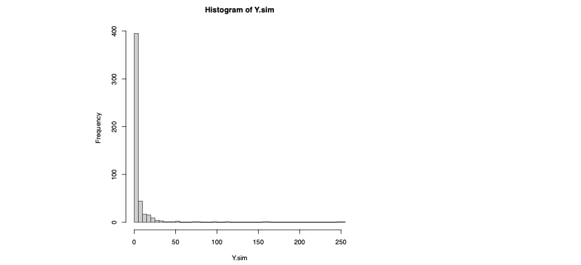

### La transformada integral de probabilidad


El método general para la simulación de variables aleatorias a partir de simulaciones de uniformes en el intervalo (0,1) se basa en un resultado conocido como el teorema de la transformada integral de la probabilidad. En dicho resultado interviene la función de distribución o función acumulada de probabilidad, que (en el caso de una variable continua) se obtiene a partir de la función de densidad p(y) integrando:

$$F(y) = \int_{-\infty}^{y} p(t) dt.$$

El resultado dice que la función $Z = F(Y)$ de la variable aleatoria $Y$ (y por tanto otra variable aleatoria) se distribuye $Z \sim \text{unif}(0,1)$. Lo más interesante es la parte inversa de esta relación, puesto que si $Z \sim \text{unif}(0,1)$ entonces

$$Y = F^{-1}(Z) \sim p(Y).$$

Por tanto, si $z_1,z_2,...,z_n$ son una simulación de la distribución $\text{unif}(0,1)$ entonces

$$Y_1 = F^{-1}(z_1), Y_2 = F^{-1}(z_2), ... , Y_n = F^{-1}(z_n),$$

es una muestra simulada $Y \sim p(Y)$.

> **La transformada integral de probabilidad y la simulación de precios de acciones**
>
>Supongamos que queremos simular posibles precios futuros de una acción, y la variable aleatoria $Y$ representa el precio de esta acción. Si asumimos que los precios siguen una distribución log-normal, la función de densidad de probabilidad $p(y)$ sería:
>
>$$
>p(y) = \frac{1}{y \sigma \sqrt{2\pi}} e^{-\frac{(\ln y - \mu)^2}{2\sigma^2}}
>$$
>
> 
>
>Para simular el precio de la acción:
>
>1. Generamos una muestra aleatoria $z_1, z_2, ..., z_n$ de una distribución uniforme $\text{unif}(0,1)$.
>2. Transformamos esta muestra utilizando la función inversa de la distribución acumulada log-normal $F^{-1}(z)$.
>3. Los valores resultantes $Y_1 = F^{-1}(z_1), Y_2 = F^{-1}(z_2), ..., Y_n = F^{-1}(z_n)$ representarán una muestra simulada de los precios futuros de la acción.
>
>Esto nos permite simular escenarios de precios que se derivan de un modelo estadístico, en lugar de simplemente inventar números sin fundamentos.
>
>La razón por la que el precio de una acción a veces se modela como log-normal se debe a las propiedades inherentes de los precios de las acciones y a cómo estos se comportan en el tiempo. Vamos a desglosarlo para entenderlo mejor:
>
>* Multiplicatividad: Los precios de las acciones no siguen una ruta aditiva (donde se suman o restan cantidades fijas) sino una multiplicativa. Esto significa que el precio cambia por un factor (por ejemplo, aumenta un 10% o disminuye un 5%) en lugar de por una cantidad fija (aumenta 1€ o disminuye 1€). La distribución log-normal es adecuada para modelar este comportamiento porque se basa en el producto de muchas variables aleatorias pequeñas e independientes, lo que se asemeja a los retornos porcentuales de una acción a lo largo del tiempo.
>* Limitación de valores negativos: Dado que el precio de una acción no puede ser negativo, un modelo que permita valores negativos no sería adecuado. La distribución log-normal se define solo para valores positivos, lo que la hace apropiada para modelar precios de acciones.
>* Asimetría: Los precios de las acciones tienen distribuciones asimétricas; es decir, tienen una cola larga hacia la derecha. Esto se debe a que, teóricamente, el precio de una acción puede aumentar sin límite, pero no puede caer por debajo de cero. La distribución log-normal captura esta asimetría.
Sin embargo, la modelización de precios de acciones es compleja y, aunque la distribución log-normal es útil, existen varias limitaciones y suposiciones. En la realidad, los movimientos de los precios de las acciones pueden ser afectados por eventos imprevistos, volatilidad, y otros factores que no se ajustan perfectamente a una distribución log-normal.
>
>Por estas razones, los financieros y economistas también exploran otros modelos y distribuciones, como:
>
>* Modelos GARCH (Generalized Autoregressive Conditional Heteroskedasticity): Estos modelos son útiles para modelar la volatilidad de los precios de las acciones, que puede cambiar con el tiempo.
>* Distribución de Pareto (Ley de Potencia): Para modelar las colas pesadas y eventos extremos ("black swans") en los datos financieros.
>* Distribución de T de Student: Para cuando los datos tienen colas más pesadas de lo que puede capturar la distribución normal, lo que puede ser útil para modelar retornos financieros que experimentan eventos extremos con mayor frecuencia de lo que predicen las distribuciones normales o log-normales.

Practiquemos este método en un caso concreto. Supongamos que queremos simular una variable aleatoria continua $Y$ con función de densidad:

###### (8)

$$
p(y) = \begin{cases} 
1/y^2 & \text{si } y \geq 1 \\
0 & \text{en el resto}
\end{cases}
$$


Para aplicar la transformada integral de probabilidad necesitamos la función de distribución:

$$F(y) = \int_{1}^{y} \frac{1}{t^2} dt = \left[ -\frac{1}{t} \right]_{1}^{y} = 1 - \frac{1}{y}, \text{ si } y > 1.$$

Para obtener la inversa de esta función de distribución planteamos la ecuación

$$Z = F(Y)$$

de la que despejamos $Y = F^{-1}(Z):$

$$Y = \frac{1}{1 - Z}$$

Ahora, si tenemos la muestra $z_1,z_2,...,z_n$ simulada $\text{unif}(0,1)$ entonces

$$Y_1 = F^{-1}(z_1) = \frac{1}{1 - z_1}, \quad Y_2 = F^{-1}(z_2) = \frac{1}{1 - z_2}, \quad ..., \quad Y_n = F^{-1}(z_n) = \frac{1}{1 - z_n}$$

es una muestra simulada $Y \sim p(Y)$, $p(y) = \frac{1}{y^2}$ en $y > 1$.

En R, podemos conseguir una muestra simulada de tamaño $N = 500$ de $Y$ ejecutando (el resultado lo guardamos en el objeto $y.sim$, que es un vector):

```r
y.sim <- 1/(1 - runif(500))
```

La anterior instrucción funciona por la característica vectorial de funcionamiento de R en la que una función aplicada a un vector produce un vector obtenido componente a componente. Podemos ver un histograma de la muestra simulada ejecutando:

```r
> hist(Y.sim, breaks=50, col=gray(0.8), border=gray(0.2))
```

el gráfico producido lo hemos incluido en la Figura [4]().

> ###### Figura 4.  
> Histograma de la muestra simulada de tamaño $N = 500$ de una variable aleatoria con función de densidad $p(y)$ expresada en la ecuación 8. Este histograma es una aproximación numérica a la distribución de probabilidad $p(y)$ que observamos se concentra fuertemente en valores pequeños de y (que necesariamente son $y > 1$), pero que se caracteriza por tener una cola derecha de probabilidad bastante pesada ya que podemos encontrar valores muy grandes




Como hemos visto, la aplicación de este método requiere disponer de una expresión explícita de la función de densidad (no vale conocerla a excepción de constante, es decir, con el símbolo de $\infty$) y de ser capaces de obtener la función de distribución (y por tanto operar con una integral que puede ser más o menos compleja).

Estas dificultades hacen que este método de simulación tenga sus limitacio- nes, sobretodo en el paradigma bayesiano, cuando lo tratamos de aplicar para simular la distribución a posteriori (veremos cómo abordar este problema en el reto [3]()).

Sin embargo, este método ha sido de gran utilidad práctica a lo largo de la historia aplicado junto a lo que se conoce como métodos Montecarlo.

