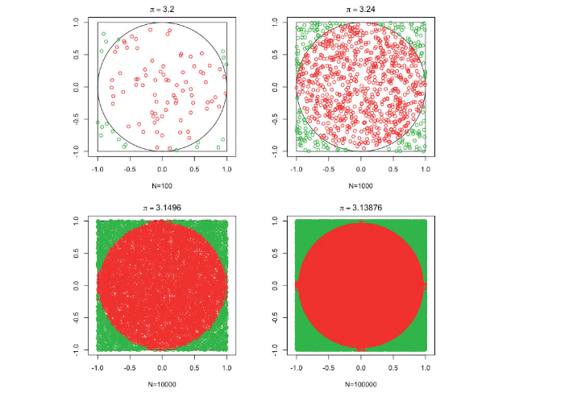

### Extra sobre métodos Montecarlo

En la línea de lo explicado antes, una de las aplicaciones más útiles de la metodología Montecarlo es el cálculo de integrales complejas. Por ejemplo, supongamos que os interesa calcular el área por debajo de una función $f(x)$ que no sabéis integrar. Podría parecer que se trata de un problema completamente determinista y que los números aleatorios no tienen nada que ver aquí, sin embargo, las técnicas Montecarlo generan una aleatoriedad _ficticia_ y se sirve de esta para resolver la integral en cuestión.

Supongamos que $f$ es una función positiva y acotada $0 \leq f(x) \leq c$ tal que la integral entre $a$ y $b$ existe y es finita. Sea $A$ el rectángulo \([a,b] \times [0,c]\) con área \((b-a)c\) y sea $B$ la región de dicho cuadrado que se encuentra entre el eje de $x$ y la curva $y = f(x)$. La integral deseada: $\int_{a}^{b} f(x)dx$ es el área de la región $B$. Para calcular este área bastará con simular dentro del cuadrado utilizando una distribución uniforme y, después, determinar la proporción de valores por debajo de la curva. Al multiplicar esta proporción por el área original del rectángulo, obtendremos el valor deseado.

De forma esquemática, el procedimiento es el siguiente:

1) Simulamos un punto $(x,y)$ dentro del cuadrado utilizando una distribución uniforme.

2) Para cada punto obtenemos $I(y_i \leq f(x_i))$ que valdrá $1$ si se cumple la condición y $0$ si no.

3) Calcularíamos el área de $B$ como:

$$
\int_{a}^{b} f(x)dx = (b-a)c \frac{1}{N} \sum_{i=1}^{N} I(y_i \leq f(x_i))
$$

Si lo pensamos desde el punto de vista de la transformada integral de probabilidad, estamos generando una variable aleatoria discreta binaria $I(y_i \leq f(x_i))$ que toma valor $1$ con probabilidad $p$ proporcional al área bajo la curva. Después estamos calculando su media que coincide con la probabilidad indicada, utilizando Montecarlo. Esto es:

$$
\mathbb{E}[I(y_i \leq f(x_i))] = \hat{p} = \frac{1}{N} \sum_{i=1}^{N} I(y_i \leq f(x_i)).
$$

La ley de los grandes números nos asegura que, si $N$ es lo suficientemente grande, esta aproximación convergerá al verdadero valor.

¿Cuánto $N$ debemos usar? Para la mayoría de ocasiones, un $N$ de 1.000 es suficiente. En el cálculo de probabilidades y en concreto de probabilidades que esperamos que sean pequeñas (de eventos extremos) es necesario aumentar el $N$ a 10.000 o incluso más.

>###### Ejemplo 9
>
>**Estimación Montecarlo de $\pi$.** Utilizando está técnica se pueden aproximar constantes matemáticas que puedan identificarse como áreas bajo una curva. Es el caso, por ejemplo, de la aproximación al número $\pi$. Para ello, solo tenemos que simular $n$ en el cuadrado \([0,1] \times [0,1]\) y quedarnos con los puntos que cumplan la ecuación $x^2 + y^2 < 1$. Esto sumordinará la proporción del área del cuadrado (cuyo total es $2^2=4$) que pertenece al círculo.
>
>Las gráficas de la Figura 7 nos muestran el valor aproximado de $\pi$ al aumentar $N$

> ##### Figura 7 
> Aproximación al número $\pi$ mediante métodos Montecarlo

