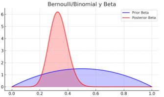
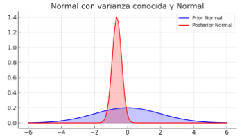

Cuando se realiza una inferencia bayesiana con datos binarios ([¿y con no binarios?](#inferencia-bayesiana-con-datos-no-binarios)), la distribución a priori y la verosimilitud trabajan juntas para proporcionar una distribución a posteriori. La belleza de usar la distribución beta como a priori para una verosimilitud Bernoulli es que ambas son matemáticamente "conjugadas", lo que significa que la forma funcional de la distribución posterior permanecerá en la misma familia (beta), simplificando la actualización de las creencias con nueva evidencia.

1. **Función de Verosimilitud `L(θ, y)`**: Esta función indica la probabilidad de los datos observados `y` dado un parámetro `θ`. Se determina por el modelo estadístico que se utiliza. Por ejemplo, para un modelo de lanzamiento de moneda, se emplearía una distribución de Bernoulli para la verosimilitud, donde `θ` sería la probabilidad de obtener cara.

2. **Distribución a Priori `p(θ)`**: Representa el conocimiento o creencias previas acerca del parámetro `θ` antes de ver los datos. La elección de esta distribución es más subjetiva y puede ser desafiante, ya que depende del conocimiento previo sobre el parámetro a inferir.

El desafío con la distribución a priori es seleccionar una que permita calcular de forma manejable una distribución a posteriori `p(θ | y)` que se combine con la verosimilitud proporcionada por los datos.

Cuando no estamos trabajando con datos binarios, el concepto de previas conjugadas sigue siendo una herramienta poderosa en el aprendizaje bayesiano. La idea clave es elegir una distribución previa que sea matemáticamente conveniente con respecto a la verosimilitud, de tal manera que la distribución a posteriori resultante sea fácil de calcular y pertenezca a la misma familia de distribuciones que la previa. Este enfoque no está limitado a datos binarios y se puede aplicar a varios tipos de datos y modelos.

Por ejemplo, si tus datos siguen una distribución normal, que es común en muchas aplicaciones prácticas, podrías usar una previa normal para la media si esta es desconocida, y una previa gamma o inversa-gamma para la varianza si también es desconocida. La conjugación aquí significa que, tras observar los datos y aplicar la verosimilitud normal, la distribución a posteriori para la media también será normal, y para la varianza será gamma o inversa-gamma, facilitando la interpretación y el cálculo de las estimaciones posteriores.

Para introducir las previas conjugadas en un contexto no binario, podríamos seguir estos pasos:

1. Determinar la forma de la verosimilitud: Esto depende de la naturaleza de tus datos. Por ejemplo, si los datos parecen distribuirse normalmente, la verosimilitud que usarías sería la función de densidad normal.
2. Identificar la familia de distribuciones conjugadas: Busca una distribución previa que, cuando se combine con tu verosimilitud elegida, resulte en una distribución a posteriori de la misma familia. Las tablas de distribuciones conjugadas pueden ser útiles aquí.
3. Selección de la previa: Elige parámetros para tu distribución previa conjugada que reflejen tu conocimiento o incertidumbre antes de ver los datos. Esto podría basarse en conocimientos anteriores, información experta, o ser una distribución no informativa si careces de información previa.
4. Actualización a la distribución a posteriori: Usa el teorema de Bayes para actualizar tu previa con los datos observados, lo que te dará la distribución a posteriori. Dado que has elegido una previa conjugada, deberías poder realizar esta actualización de manera analítica o con cálculos simplificados.
5. Interpretación: Interpreta los resultados a partir de tu distribución a posteriori, que te dará una medida de creencia actualizada en los parámetros de tu modelo después de haber visto los datos.

El uso de previas conjugadas es especialmente valioso cuando necesitas realizar actualizaciones repetidas a medida que llegan nuevos datos, un proceso común en entornos de aprendizaje automático y estadística.

**Distribuciones Conjugadas Previas**

La solución a este desafío es el uso de `distribuciones conjugadas previas`. Al utilizar una distribución a priori que es conjugada de la verosimilitud del modelo, se asegura que la distribución a posteriori pertenezca a la misma familia de la distribución a priori, simplificando el cálculo.

Por ejemplo, 

- Cuando la **verosimilitud es Binomial**, una opción natural para la distribución a priori es la **distribución Beta**. La razón es que la Beta es conjugada de la verosimilitud Binomial, lo que significa que la **distribución a posteriori** resultante también será una distribución Beta. Esto es beneficioso porque:

  - **Simplifica los Cálculos**: No hay necesidad de resolver integrales complejas para encontrar la distribución a posteriori.
  - **Facilita la Actualización**: Cuando obtenemos nuevos datos, podemos actualizar nuestra distribución a posteriori simplemente ajustando los parámetros de la Beta, sin tener que recalcular toda la distribución desde cero.

Por ejemplo, si empezamos con una distribución a priori `Beta(α, β)` y observamos `z` éxitos en `N` ensayos, la distribución a posteriori será `Beta(α + z, β + N - z)`. Esto permite una actualización directa y sencilla de nuestras creencias después de considerar los nuevos datos.

### Procedimientos de Aprendizaje Conjugados

Los procedimientos de aprendizaje conjugados en estadística bayesiana involucran pares de distribuciones previas y verosimilitudes donde la distribución a priori es la "conjugada" de una verosimilitud específica. Esto resulta en que la distribución a posteriori pertenece a la misma familia que la previa. A continuación, algunos pares conjugados comunes:

1. **Bernoulli / Binomial y Beta**:
   - **Verosimilitud:** Bernoulli o Binomial (para ensayos independientes con dos resultados posibles).
   - **Priori Conjugada:** Beta.
   - **Resultado:** La distribución a posteriori es Beta con parámetros actualizados según los éxitos y fracasos observados.
      > La distribución previa azul es bastante ancha, lo que indica una incertidumbre relativamente alta o una creencia poco informativa sobre la probabilidad de éxito en un ensayo de Bernoulli antes de ver los datos. La distribución posterior roja es más puntiaguda y está desplazada hacia un valor específico de probabilidad, lo que sugiere que los datos observados han proporcionado información que ajusta y refina la creencia acerca de la probabilidad de éxito.
      >
      > Este cambio de una previa más plana y ancha a una posterior más estrecha y puntiaguda es típico en análisis bayesianos: al obtener datos, las creencias se actualizan, y la incertidumbre se reduce respecto a la estimación del parámetro de interés.
      > 

2. **Normal con varianza conocida y Normal**:
   - **Verosimilitud:** Normal con varianza conocida.
   - **Priori Conjugada:** Normal.
   - **Resultado:** La distribución a posteriori es Normal con una media actualizada.

      > 
      > En la gráfica, la distribución azul es bastante ancha, lo que indica una alta incertidumbre en la creencia previa sobre el parámetro. La distribución roja es más angosta y está centrada en un valor distinto, lo que indica una mayor confianza en la estimación del parámetro después de haber observado los datos. Esto es característico de cómo se actualiza una distribución normal en un análisis bayesiano cuando se conoce la varianza: la media de la distribución posterior se mueve hacia la media de los datos observados, y la varianza se reduce, lo que aumenta la precisión de la estimación.

3. **Normal con media conocida y Gamma**:
   - **Verosimilitud:** Normal con media conocida.
   - **Priori Conjugada:** Gamma (para la precisión, el inverso de la varianza).
   - **Resultado:** La distribución a posteriori es Gamma, reflejando una precisión actualizada.

4. **Poisson y Gamma**:
   - **Verosimilitud:** Poisson (para contar eventos en un espacio o intervalo continuo).
   - **Priori Conjugada:** Gamma (para la tasa de eventos).
   - **Resultado:** La distribución a posteriori es Gamma con parámetros basados en el número de eventos observados.

5. **Exponencial y Gamma**:
   - **Verosimilitud:** Exponencial (para modelar el tiempo hasta un evento).
   - **Priori Conjugada:** Gamma (para la tasa del evento).
   - **Resultado:** La distribución a posteriori es Gamma con parámetros actualizados por los tiempos observados hasta los eventos.

6. **Multinomial y Dirichlet**:
   - **Verosimilitud:** Multinomial (para datos categóricos con múltiples categorías).
   - **Priori Conjugada:** Dirichlet (para las probabilidades de las categorías).
   - **Resultado:** La distribución a posteriori es Dirichlet con parámetros actualizados por los recuentos de observaciones por categoría.

Estos pares permiten actualizaciones analíticas y directas de la distribución previa con la incorporación de nuevos datos.

## Inferencia Bayesiana con Datos No Binarios

En el contexto de la inferencia bayesiana, el proceso general no cambia significativamente cuando los datos no son binarios, pero las formas específicas de las distribuciones a priori, de verosimilitud y a posteriori pueden variar dependiendo del tipo de datos y del modelo subyacente.

#### Selección del Modelo y las Distribuciones

- **Datos continuos**: Si tienes datos que siguen una distribución normal, podrías utilizar una distribución normal para la verosimilitud y elegir una distribución conjugada como la distribución normal inversa gamma para la a priori si estimas tanto la media como la varianza, o una normal para la media si la varianza es conocida.
- **Datos de conteo**: Si los datos representan conteos o números enteros, como el número de eventos en un intervalo de tiempo, podrías modelarlos usando una distribución de Poisson para la verosimilitud y una distribución Gamma para la a priori (si se considera la tasa como desconocida).

#### Cálculo de la Verosimilitud

Independientemente del tipo de datos, la verosimilitud se calcula utilizando la probabilidad de observar los datos dados los parámetros del modelo. Para datos continuos, esto podría ser la densidad de la distribución normal, y para datos de conteo, la función de masa de probabilidad de la Poisson.

#### Actualización Bayesiana

- Se combinan la información a priori (creencias previas sobre los parámetros antes de ver los datos) y la información proporcionada por los datos actuales (a través de la verosimilitud) para obtener la distribución a posteriori.
- Para muchos modelos comunes, especialmente aquellos que usan distribuciones conjugadas, esta actualización puede realizarse de forma analítica, resultando en una nueva distribución que es fácil de interpretar y usar para inferencias posteriores.

#### Distribución a Posteriori

La distribución a posteriori refleja la actualización de nuestras creencias sobre los parámetros del modelo después de considerar los datos. En modelos donde no es posible una solución analítica o donde las distribuciones no son conjugadas, métodos numéricos como el muestreo de Monte Carlo por cadenas de Markov (MCMC) pueden ser utilizados para aproximarse a la distribución a posteriori.

La inferencia bayesiana es muy flexible y puede adaptarse a muchos tipos de datos y modelos. Lo importante es elegir correctamente las distribuciones a priori y de verosimilitud que mejor se adapten a la naturaleza de los datos y al conocimiento previo del problema en cuestión.
