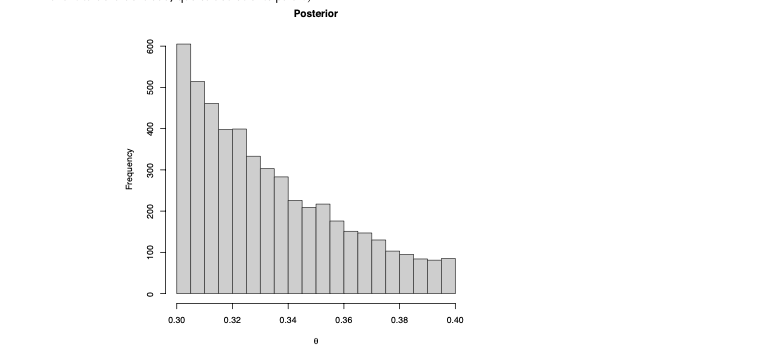

### Simulación en el contexto bayesiano

En el método bayesiano, en el que el resultado principal es una distribución de probabilidad (la distribución _a posteriori_) sintetizar la información que contiene es de vital importancia. Vamos a usar la técnica de simulación como método numérico para describir aspectos interesantes de la distribución _a posteriori_. Ahora, el papel de la variable aleatoria lo tiene $\theta$ y obtendremos simulaciones $\theta_1, \theta_2, \ldots, \theta_n$ obtenidas de su distribución _a posteriori_.

Utilizaremos un ejemplo en este empeño.

¿Recordáis el ejemplo 3 de la página 11 sobre las expediciones abisales para aprender sobre $\theta$ la concentración salina media en una parte concreta del océano? En la ecuación 4 obtuvimos que, gracias a la información muestral y la información _a priori_ sobre este parámetro, su distribución _a posteriori_ es

$$
p(\theta | Y = 21.75) = \frac{e^{-21.75\theta}}{C_2}, \quad \theta \in [0.3,0.4].
$$

con

$$
C_2 = \frac{1}{21.75} \left(e^{-21.75 \cdot 0.3} - e^{-21.75 \cdot 0.4}\right).
$$

Vamos a simular valores de $\theta$ de su distribución _a posteriori_, usando el método de Montecarlo, y usaremos estas simulaciones para hacer inferencias sobre $\theta$. En primer lugar necesitamos la función de distribución:

$$
F(\theta | Y = 21.75) = \int_{0.3}^{\theta} p(t | Y = 21.75)dt = \int_{0.3}^{\theta} \frac{e^{-21.75t}}{C_2} dt = \frac{1}{21.75 \cdot C_2} \left[ e^{-21.75 \cdot 0.3} - e^{-21.75 \cdot \theta} \right].
$$

Ahora obtenemos la función de distribución inversa planteando la ecuación:

$$
F(\theta | Y = 21.75) = z, \text{ despejando } \theta:
$$

$$
e^{-21.75 \cdot 0.3} - e^{-21.75 \cdot \theta} = 21.75 \cdot C_2 \cdot z
$$

con lo que:

$$
\theta = -\frac{1}{21.75} \log \left(e^{-21.75 \cdot 0.3} - 21.75 \cdot C_2 \cdot z\right).
$$

Para simular de $\theta$ de su distribución _a posteriori_, lo que hacemos es simular $z \sim \text{unif}(0,1)$ y aplicar la ecuación anterior. En R esto es sencillo. En el siguiente código primero definimos la función $F^{-1}$ definida justo arriba y luego la aplicamos a $N = 5000$ valores simulados de $\text{unif}(0,1)$. Las dos primeras líneas de código recuperan la obtención de la constante $C_2$ ya vista en el ejemplo.


```r
> Cposterior <- function(theta){exp(-21.75*theta)}
> C2 <- integrate(Cposterior, lower=0.3, upper=0.4)[[1]]
> Finverse <- function(z){-log(exp(-21.75*0.3)-21.75*C2*z)/21.75} 
> theta.sim<- sapply(runif(5000), FUN=Finverse)
```

En la última sentencia hemos aplicado, con el comando `sapply` la función $F^{-1}(z)$ al vector `theta.sim` que contiene la muestra simulada de la uniforme en (0,1). ¿Cómo utilizamos ahora esta simulación de la distribución _a posteriori_ para informar (inferir) sobre $\theta$? Lo justo es empezar calculando la aproximación a la probabilidad:

$$
P(\theta \in [0.33,0.37] | Y = 21.75).
$$

Resolvimos esta integral explícitamente y con métodos numéricos de integración y obtuvimos que era aproximadamente 0.34. Para utilizar la simulación anterior para calcular esta integral, basta obtener la frecuencia relativa de $\theta$ simulados que están en el intervalo [0.33,0.37]:


```r
> thetainInterval <- theta.sim >0.33 & theta.sim <0.37 
> mean(thetainInterval)
```

En la primera línea del código anterior hemos obtenido un vector lógico, del mismo tamaño que `theta.sim` que tiene un `TRUE` o un `FALSE` dependiendo de si el componente correspondiente de `theta.sim` cumple la doble condición (está por tanto en el intervalo). En la segunda línea hemos obtenido la media de este vector y por lo tanto es una media de 1 o 0 y la frecuencia relativa de 1 en el vector.

Con la simulación anterior podemos fácilmente resumir otros aspectos de la distribución _a posteriori_. Por ejemplo, la media _a posteriori_ de $\theta$, que teóricamente se representa como $E(\theta | Y = 21.75)$ la aproximamos por la media aritmética de la muestra simulada:


```r
> mean(theta.sim)
[1] 0.3330422
```

la varianza a posteriori, V(θ | Y = 21.75):

```r
> var(theta.sim)
[1] 0.0006690736
```

o la desviación típica σ(θ | Y = 21.75):

```r 
> sd(theta.sim)
[1] 0.02586646
```

Por último es de interés conocer la forma de la distribución a posteriori, lo que podemos hacer utilizando un histograma con el siguiente código:

```r
> hist(theta.sim, xlab=expression(theta), main="Posterior", breaks=20, + col=gray(0.8), border=gray(0.2))
```

El gráfico resultante está en la Figura 5, resultando esta distribución de frecuencias en forma de histograma una aproximación a la densidad _a posteriori_ de la ecuación 4.

Figura 5 Aproximación de la función de densidad _a posteriori_ $p(\theta | Y = 21.75)$ a partir de una simulación de tamaño $N = 5000$ de esta distribución. Este histograma sugiere que la moda _a posteriori_ está en el límite inferior, 0.30 (hecho este que ya podíamos ver en la forma analítica de la densidad, que es decreciente para $\theta$)




