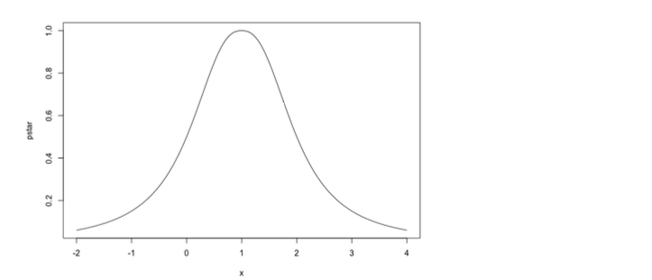

### 1. Cuando la distribución a posteriori no es explícita

En el apartado 1 del presente módulo introducimos la necesidad de tener métodos de simulación avanzados en inferencia bayesiana mediante dos ejemplos. En el apartado 2 nos salimos momentáneamente del contexto bayesiano para repasar los conceptos clave de la simulación Monte Carlo por cadenas de Markov (MCMC).


#### Introducción a los métodos de simulación avanzados en inferencia bayesiana

El aprendizaje bayesiano está basado en la distribución a posteriori $p(\theta \mid y)$. Como ya hemos visto, esta función contiene la información experimental (cuyo resultado está contenido en la muestra observada $y$) y la información que contiene la función de verosimilitud $L(\theta,y)$ y la distribución a priori $p(\theta)$. En el contexto bayesiano, realizar inferencias sobre parámetros desconocidos se reduce a resumir convenientemente la distribución a posteriori. En problemas sencillos, la distribución a posteriori adopta la forma de una distribución de probabilidad condicional, lo cual simplifica mucho el proceso inferencial. El escenario favorable es el que conocemos como de distribución a posteriori en forma explícita o forma cerrada, y posibilita realizar el ejercicio bayesiano de forma exacta basada en herramientas matemáticas (principalmente integrales). Las situaciones que hemos visto hasta ahora en el curso son de este tipo.

Las distribuciones a posteriori explícitas surgen cuando utilizamos una distribución a priori conjugada y el número de parámetros (la dimensión de $\theta$) es muy pequeño. Vimos ejemplos de inferencias bayesianas en el resto anterior usando previas conjugadas. Cuando la distribución a priori no es conjugada o el número de parámetros es moderado o elevado, la distribución a posteriori no tiene una forma matemática tratable. Vamos a introducir esta problemática en un par de ejemplos que volveremos a utilizar en el caso práctico y que, además, nos servirán como ejercicio de repaso del contenido presentado hasta ahora. El primero de los ejemplos es de un solo parámetro desconocido, mientras que en la segunda situación tenemos dos parámetros desconocidos.

> **Distribución de Cauchy** : La distribución de Cauchy tiene una forma acampanada como la normal, pero tiene colas mucho más pesadas, con lo que permite valores de μ (a priori en este caso) más distantes de su centro. Es además el caso particular de la distribución t-Student con un grado de libertad.

##### Ejemplo 1

En este ejemplo el modelo asumido para las observaciones $Y_1, Y_2, \ldots, Y_n$ es normal de media $\mu$ y de varianza $\sigma^2$, que son parámetros conocidos. Además, las observaciones son independientes entre sí. Por tanto, la función de verosimilitud es:

$$L(\mu,y) = \prod_{i=1}^n \text{Normal}(y_i \mid \mu,\sigma) = \prod_{i=1}^n \frac{1}{\sqrt{2\pi\sigma^2}} \exp\left(-\frac{1}{2\sigma^2} (y_i-\mu)^2\right), \mu \in \mathbb{R}$$

La distribución a priori para $\mu$ que es conjugada a la distribución normal, pero en este problema se utiliza la distribución de Cauchy:

$$p(\mu) = \frac{1}{1 + \pi \mu^2}, \mu \in \mathbb{R}$$


Para obtener la distribución a posteriori, aplicamos la fórmula implícita del teorema de Bayes (con el símbolo de proporcionalidad ( $\propto$ ):


$$p(\mu \mid y) \propto L(\mu,y)p(\mu) = \left(\prod_{i=1}^{n} \frac{1}{\sqrt{2\pi\sigma^2}} \exp\left(-\frac{(y_i - \mu)^2}{2\sigma^2}\right)\right) \times \frac{1}{1 + \pi \mu^2}$$


Las constantes (que no dependen de $\mu$) no importan, por lo que también podemos escribir:


$$p(\mu \mid y) \propto \exp\left(-\frac{1}{2\sigma^2} \sum_{i=1}^{n} (y_i - \mu)^2\right) \times \frac{1}{1 + \pi \mu^2}$$


Esta distribución a posteriori no es una distribución Cauchy, lo que demuestra que la distribución a priori que se está usando en esta ocasión (Ecuación 1) no es conjugada, pues de serlo, la distribución a posteriori tendría que haber sido Cauchy también. Más problemático aún es que esta distribución a posteriori no es de ninguna de las familias habituales y difícilmente podemos aspirar a tener una forma explícita para ella, es decir, a poder cambiar el símbolo de ( $\propto$ ) por = (que la constante de integración corresponde a una integral que solo se puede resolver por métodos numéricos). Este es un caso de una distribución a posteriori que no es explícita, por lo que no podemos obtener resultados exactos que nos sirvan para hacer inferencia. En concreto, no podemos calcular explícitamente la moda a posteriori, ni su intervalo de probabilidad.

Alternativamente, nos gustaría poder simular de la distribución a posteriori, pero tampoco podemos aplicar la función de distribución inversa. Lo que haremos será construir simulaciones de la distribución a posteriori de manera aproximada utilizando métodos avanzados de simulación para los que no es necesario conocer la constante de integración.

Nuestro segundo ejemplo tiene dos parámetros y, como en el caso anterior, la distribución a priori no es conjugada.


##### Ejemplo 2

En este caso vamos a ver un modelo sencillo de punto de cambio en el que las primeras $m$ observaciones $Y_1, \dots, Y_m$ se distribuyen Poisson de media $\lambda$ (desconocida), mientras que las siguientes $2m$ observaciones $Y_{m+1} \dots Y_{3m}$ también Poisson pero de media $\delta \lambda$ donde $\delta$ (también desconocido) es mayor que 1. Todas las observaciones son independientes entre sí:

$$
Y_i \sim \text{Pois}(\lambda), \quad i = 1, 2, \dots, m
Y_j \sim \text{Pois}(\delta \lambda), \quad j = m+1, m+2, \dots, 3m
$$

Esta situación se podría corresponder con un análisis estadístico de calidad en el que se observan diariamente los defectos producidos por cierta maquinaria. En las condiciones habituales, la media de defectos al día es un valor desconocido al que denotaremos $\lambda$. A partir del día $m + 1$ se propone un sistema de ahorro que requiere en la sensibilidad de la producción y que, por tanto, puede haber aumentado el número de defectos multiplicados por otro valor, también desconocido y que denotaremos $\delta$.

Valores de $\delta$ aproximadamente 1 testificarían que no ha habido cambios en la media de defectos, mientras que valores grandes de $\delta$ se suponen muchos más defectos que en la configuración inicial de la producción.

La función de verosimilitud para $y = (y_1, \dots, y_{3m})$ depende entonces de dos parámetros $\lambda, \delta$:

$$
L(\lambda, \delta) = \prod_{i=1}^{m} \text{Pois}(y_i | \lambda) \times \prod_{j=m+1}^{3m} \text{Pois}(y_j | \delta \lambda)
$$


Lo que importa en esta función son los factores que dependen de $\delta$ y $\sigma$, por lo que podemos escribir, en forma más compacta:

$$
L(\lambda, \sigma, y) = e^{-m(\lambda+1)\sigma} \sigma^{5y_6 + 5y_7}
$$

donde $S$ es la suma de las primeras $m$ observaciones y $y_6$ de las $m$ siguientes. Este escenario se parece al proceso con observaciones Poisson y distribución a priori Gamma, pero no coincide exactamente. De hecho, es difícil pensar en distribuciones a priori que fueran conjugadas.

En cualquier caso, suponemos que las distribuciones a priori son $p(\lambda) = \text{Gamma}(\lambda | a,b)$ e independientemente $p(\sigma) = \text{Unif}(1,2)$. Esta última distribución sobre $\sigma$ refleja que no tenemos información a priori para distinguir ningún valor de $\sigma$ en un intervalo inicial. Los parámetros de la prior dependen de la información a priori para $\lambda$ y $\sigma$ se asignan utilizando información de expertos.

La distribución a posteriori es:

$$
p(\lambda, \sigma \mid y) \propto L(\lambda, \sigma, y) \times e^{-a\lambda} \lambda^{a-1} \sigma^{a+b-1} e^{-b\lambda}, \quad \text{para } \lambda > 0, \sigma \in (1,2).
$$

>Esta distribución a posteriori no es del tipo gamma multiplicada por uniforme como la previa, y por tanto la previa de este problema no es conjugada. Evidentemente, que la previa no tenga esta propiedad no es ningún problema en sí misma, lo que es un gran inconveniente es que la distribución a posteriori no tiene una forma reconocible. Como en el ejemplo anterior, no tiene una forma explícita y su forma implícita no es muy útil para obtener resúmenes, o lo que es lo mismo, inferencias sobre los parámetros desconocidos.


Los ejemplos anteriores ponen de manifiesto la principal dificultad de los métodos bayesianos: disponer de métodos para resumir y explorar una distribución a posteriori que en la gran mayoría de las ocasiones no la tenemos en forma explícita.

Uno se puede preguntar por qué no usamos rutinariamente distribuciones a priori conjugadas. En primer lugar, no siempre existen distribuciones con esta propiedad (y de hecho, conforme el modelo es más complejo es más difícil que existan). En el ejemplo 2 nos hemos encontrado con una situación de este tipo. Por otro lado, las distribuciones a priori conjugadas no tienen por qué ser adecuadas para el problema que se está estudiando. En este sentido, debemos indicar en qué, aunque tener una forma tratable de la distribución a posteriori es conveniente, esta propiedad no debe guiar la asignación de la priori, que principalmente debe atender a acomodar la información a priori de la que se dispone.


La cuestión es, entonces, qué podemos hacer para hacer inferencia a posteriori sobre los parámetros de interés, si desconocemos la forma que tiene la distribución a posteriori. Pues bien, para ello vamos a recurrir a lo que se conoce como métodos MCMC, siglas que se corresponden con el acrónimo en inglés para la técnica de simulación Monte Carlo por cadenas de Markov.


### 2. Simulación Monte Carlo por cadenas de Markov (MCMC)


Como ya estudiamos en el reto 1, los métodos Monte Carlo hacen referencia al uso de números (pseudo)aleatorios para resolver cuestiones complejas. En el caso de MCMC, los números (pseudo)aleatorios nos ayudarán a simular de una distribución de la que desconocemos su forma y cuya constante es difícil calcular de manera analítica. En el caso concreto del análisis bayesiano, para simular de distribuciones a posteriori muchas veces utilizaremos y dificultaréis la distribución montecarlo. Por ende, para poder entender cómo funcionan los métodos MCMC, debemos entender primero qué son las cadenas de Markov.

Las cadenas de Markov son un tipo de proceso estocástico introducido por Andrey Markov en 1906. Su objetivo principal era poder aplicar la ley de los grandes números cuando las variables aleatorias que componen la muestra no son independientes. Pero, empecemos por el principio, ¿qué es un proceso estocástico?

#### Procesos estocásticos

El mejor modo de entender qué es un proceso estocástico es mediante un ejemplo.

Imaginemos que cada cinco minutos la gente de un supermercado se acerca a la cola de las cajas y observa cuantas personas hay en ella con el objetivo de controlar que no llegue a 7, ya que, en el momento en el que lo haga, será necesario abrir una nueva caja.

La primera vez que sale estar observando la variable aleatoria $X(0)$ número de personas en la cola en el instante inicial $t = 0$, en el tiempo $t = 1$ observará $X(1)$ y así sucesivamente. A $X(0)$ se le denomina estado inicial, mientras que, a $X(t)$, se le conoce como estado del proceso en el momento $t$.

En este escenario, llamamos *espacio de estados* al conjunto de los posibles valores que puede tomar cada una de las variables $X(t)$, que en nuestro caso sería $ \{0,1,2,...,7\} $.

#### Cadenas de Markov

Una de las características principales que distingue a los procesos estocásticos es que lo que sucede en un instante concreto de tiempo $X(t)$ está condicionado con lo que haya pasado en instantes anteriores de tiempo. Se trata, por tanto, de una sucesión de variables no independientes.


Los tipos de relación temporal pueden ser muy variados y las cadenas de Markov representan un caso particular. Una cadena de Markov es un proceso estocástico $X(t)$, $X(t+1)$, \ldots tal forma que la distribución de $X(t+1)$ condicionada a los valores anteriores $X(t)$, $X(t-1)$, \ldots solo depende de $X(t)$. Esto es:

$$
P(X(t+1) \mid X(t), X(t-1), \ldots, X(0)) = P(X(t+1) \mid X(t))
$$

Para entender mejor las cadenas de Markov, consideremos la situación en la que el espacio de estados es el conjunto finito $s_1, s_2, \ldots, s_k$ (como en el ejemplo introductorio del supermercado). En este caso, las probabilidades de pasar del estado $i$ al estado $j$ en un instante de tiempo $t$, es decir $P(X(t+1) = s_j \mid X(t) = s_i)$, se denomina probabilidad de transición, que se dicen estacionarias si no dependen de $t$.

Volvamos a nuestro ejemplo. Para que pudiésemos considerarlo una cadena de Markov, necesitaríamos que el número de personas en la cola solo dependa del número de personas en la cola en el instante anterior (es decir, 5 minutos antes). Las probabilidades de transición en la instancia, por ejemplo, que probabilidad hay de pasar a tener 5 personas en la cola cuando actualmente hay 3 ($p_{35}$). En este caso, la probabilidad de transición sería estadísticamente semántica. En consecuencia, los tiempos de la cola no es muy probable en un supermercado.

En adelante, vamos a trabajar solo con procesos de Markov con probabilidades de transición estacionarias y denotamos:

$$
p_{ij} = P(X(t+1) = s_j \mid X(t) = s_i),
$$

con lo que podemos construir la matriz de transición:

$$
P = \begin{pmatrix}
p_{11} & p_{12} & \ldots & p_{1k} \\
p_{21} & p_{22} & \ldots & p_{2k} \\
\vdots & \vdots & \ddots & \vdots \\
p_{k1} & p_{k2} & \ldots & p_{kk}
\end{pmatrix}
$$

Entre otras propiedades, esta matriz facilita mucho el cálculo de probabilidades de transitar de un estado a otro en $\tau$ pasos:

$$
P(X_{t+\tau} = s_j \mid X_t = s_i).
$$

En efecto, las probabilidades de pasar de un estado $s_i$ a otro $s_j$ en $n$ pasos se obtienen simplemente multiplicando $P \cdot \ldots \cdot P = P^\tau
$. Para el cálculo de la transición anterior, elegimos el elemento $ij$ de la matriz $P^n$.


En lenguaje de distribuciones de probabilidad de variables aleatorias, la matriz de transición $P$ contiene la función de probabilidad para $X(0)$ condicionada al valor del estado inicial $X_0$. En concreto, la fila $i$-ésima de $P$ contiene los valores de la función de probabilidad para $X(1) \mid X(0) = s_i$. De manera parecida se interpreta la potencia $i$-ésima de $P$, $P^i$, que como hemos argumentado antes en su fila $i$-ésima contiene las probabilidades condicionales $X^i \mid X_0 = s_i$.

Veamos todo esto en un ejemplo sencillo. Supongamos que la probabilidad de ir al cine en un día determinado solo depende de si hemos ido al cine el día anterior o no (por lo que estamos en una cadena de Markov). Además, esta probabilidad no depende del día en el que nos encontramos (las probabilidades de transición son estacionarias) y, en concreto, tenemos al cine con probabilidad 1/3 si ya hemos ido hoy y con probabilidad 1/2 si hoy no hemos ido. Con estas condiciones, la matriz de transición sería:

$$
P = \begin{pmatrix}
1/3 & 2/3 \\
1/2 & 1/2
\end{pmatrix}
$$

Para determinar la probabilidad de ir al cine dentro de 2 días asumiendo que hoy sí que hemos ido, podemos hacerlo simplemente multiplicando $P$ por sí misma y obtenemos:

$$
P^2 = P \cdot P = \begin{pmatrix}
4/9 & 5/9 \\
5/12 & 7/12
\end{pmatrix}
$$

por lo que la probabilidad que estamos buscando es 4/9.

Otra función que puede ser interesante y de hecho lo será son las distribuciones marginales de $X(t)$. Si queremos recuperar la distribución marginal de cada uno de los $X(t)$, necesitaremos conocer, además de $P$, las condiciones iniciales con las que se inició la cadena, es decir, $X(0)$ a la función de probabilidad que las genera: $P(X(0) = s_i) = p_i$ para $i = 1, \ldots, k$.

Por extensión de resultados básicos de teoría de la probabilidad, podemos deducir que conocido el vector de probabilidades iniciales $p_0 = (p_{01}, \ldots, p_{0k})$, la probabilidad marginal de $X(0) = s_j$ se corresponde con el $j$-ésimo valor del vector $p_0P$.


>Volviendo al ejemplo, si sabemos que el primer día que empecé mi política de ir al cine, elegí ir con probabilidad 1/2, la probabilidad de ir al cine el cuarto día será aproximadamente 0.43:

$$
p_0P^t = (1/2 \quad 1/2) \cdot \begin{pmatrix}
0.4290123 & 0.5709877 \\
0.4282407 & 0.5717593
\end{pmatrix} = (0.4286256 \quad 0.5713735)
$$

>Lo que resulta llamativo es que estas probabilidades marginales se estabilizan y, a partir de un número de pasos suficientemente grande, convergen a un vector de probabilidad fijo. Todavía más interesante es que este convergencia ocurre sin importar cuál sea el vector de probabilidades iniciales. En este ejemplo, si utilizamos $p_0 = (0.2,0.8)$, después de $t = 2$ y $t = 4$ pasos las probabilidades marginales serían:

$$
\begin{align*}
p_0P^2 &= (0.2, 0.8) \cdot \begin{pmatrix}
4/9 & 5/9 \\
5/12 & 7/12
\end{pmatrix} = (0.433333, 0.566667) \\
p_0P^4 &= (0.2, 0.8) \cdot \begin{pmatrix}
4/9 & 5/9 \\
5/12 & 7/12
\end{pmatrix}^2 = (0.428917, 0.571083)
\end{align*}
$$

> ya muy similares (aunque no iguales) al vector obtenido anteriormente.


Si repetimos el ejercicio anterior para un número $t \to \infty$, observaremos que la distribución límite es $(3/7, 4/7)$. Esta distribución límite es la misma independientemente de $p_0$ (siempre que no haya un estado inicial con probabilidad cero) y se conoce como **distribución estacionaria**.

El estudio detallado de la existencia de la distribución estacionaria en cadenas de Markov queda fuera del alcance de esta introducción al tema. Basta saber que las cadenas de Markov con la propiedad de que podemos ir de un estado cualquiera a otro en un número finito de pasos (la cadena se llama irreducible) tienen distribución estacionaria y esta es única.

En cadenas de Markov con espacio de estados finito, la distribución estacionaria $\pi$ se obtiene del sistema de ecuaciones $P^t P = P^*$ (cuya solución en el ejemplo del cine da $\pi = (3/7, 4/7)$).

La existencia de la distribución estacionaria es el aspecto más importante de las cadenas de Markov para su uso en la inferencia bayesiana. Más concretamente, los métodos de simulación Monte Carlo por cadenas de Markov (MCMC) son simulaciones de procesos aleatorios de cadenas de Markov cuya distribución estacionaria es una distribución de interés, que, en el caso bayesiano, será la distribución a posteriori. Simulando la cadena después de un número suficiente de pasos (lo que se llama etapa de calentamiento o _burning_) estaremos obteniendo simulaciones de la distribución deseada. Estas simulaciones son dependientes entre sí, pero si vamos descartando unas pocas cada ciertas iteraciones, nos aseguramos que sean simulaciones prácticamente independientes (lo que se conoce como _thinning_).

Existen multitud de procedimientos MCMC que varían en la cadena de Markov elegida. Cada uno de ellos puede ser más o menos apropiado según la forma de la distribución e incluso pueden combinarse para obtener mejores resultados.

A continuación estudiaremos los dos más utilizados: el muestreo de Gibbs y el método Metropolis-Hastings.

### 3. MCMC: muestreo de Gibbs y Metropolis-Hastings

El objetivo es obtener una muestra simulada de un vector aleatorio $X$ con función de densidad $p^*$ (que posiblemente no conozcamos en forma explícita), construida a partir de una cadena de Markov $X^{(0)}, X^{(1)}, \ldots$ cuya distribución estacionaria sea $p^*$. El uso de la negrita ahora en las $X$ nos advierte de que la cadena es potencialmente de naturaleza vectorial y, por tanto, cada $X^{(t)}$ está constituido por varias variables aleatorias.

Es importante hacer aquí un inciso para indicar que la notación utilizada va más allá del ámbito de la inferencia bayesiana, ya que estas técnicas sirven, en general, para estudiar distribuciones de probabilidad cuya forma es desconocida. En este sentido, cuando hablamos de un vector aleatorio $X$, en inferencia bayesiana sería más común referirse a él como un vector de parámetros desconocidos del que $p^*$ será su distribución a posteriori.

En el caso práctico veremos la aplicación de estas técnicas al mundo bayesiano y, en particular, a los ejemplos expuestos al inicio de este documento.

#### Muestreo de Gibbs

Supongamos que el vector aleatorio del que queremos simular, $X$, está formado por las componentes $X_1, X_2, \ldots, X_d$. Supongamos además que podemos obtener simulaciones de las $d$ distribuciones condicionales

$$
p^*(X_i \mid X_1, \ldots, X_{i-1}, X_{i+1}, \ldots, X_d), \quad i = 1, \ldots, d.
$$

Estas condicionales se llaman *condicionales completas* puesto que son las distribuciones de cada componente condicionadas a todas las otras. El muestreo de Gibbs utiliza estas condicionales para construir una cadena de Markov a través del proceso iterativo siguiente:

1. Inicializar con $X^{(0)} = (X^{(0)}_1, \ldots, X^{(0)}_d)$.
2. Para $t = 1, \ldots, N$:
   a. Simular $X^{(t)}_1$ de la distribución condicional $p^*(X_1 \mid X^{(t-1)}_2, \ldots, X^{(t-1)}_d)$.
   b. Simular $X^{(t)}_2$ de la distribución condicional $p^*(X_2 \mid X^{(t)}_1, X^{(t-1)}_3, \ldots, X^{(t-1)}_d)$.
   c. ...
   d. Simular $X^{(t)}_d$ de la distribución condicional $p^*(X_d \mid X^{(t)}_1, \ldots, X^{(t)}_{d-1})$.


   Se demuestra que una cadena de Markov generada de esta forma tiene a $p^*$ como distribución estacionaria, por lo que si ejecutamos el proceso para un $N$ suficientemente grande y descartamos las $B$ primeras observaciones (burning) compensando la dependencia entre las observaciones simuladas mediante un adelgazamiento (thinning), lo que obtenemos es un conjunto de simulaciones de la distribución objetivo.

Vamos a ver un ejemplo de Gibbs sampling en un ejercicio con contexto explícito de un vector aleatorio de dimensión $d = 2$.

##### Ejemplo 3

Queremos obtener una muestra simulada de la distribución conjunta bidimensional

$$p^*(x, y) = (16)^{x}(1-y)^{9x}, \quad x = 0,1,...,16, \quad 0 \leq y \leq 1.$$

Para hacer un muestreo de Gibbs, necesitamos las condicionales completas: $X$ y $Y$. Para definir de la distribución condicional, $p(x \mid y)$ es proporcional a $p(x,y)$ obviamente es una función de $x$. Por tanto:

$$p(x \mid y) = (16)^{x}(1-y)^{9x} \cdot (16)^{y}(1-y)^{16-x} \sim \text{binomial}(16,y).$$

Por tanto $X \sim \text{binomial}(16,y)$. De igual modo:

$$p(y \mid x) = x^{x}(1-y)^{9x} \sim \text{Beta}(x + 2.20, 16-x)$$

y en consecuencia $Y \sim \text{Beta}(x + 2.20, 16-x)$.

El procedimiento de generar la cadena de Markov con distribución estacionaria* será:

1. Inicializar con $(X^{(0)}, Y^{(0)})$.
2. Para $t = 1, \ldots, N$:
   - Simular $X^{(t)}$ de la distribución binomial(16,$Y^{(t-1)}$).
   - Simular $Y^{(t)}$ de la distribución Beta($X^{(t)}$+2.20, 16-$X^{(t)}$).

La clave está en que tanto la distribución condicional para $X$ como para $Y$ son conocidas y podemos simular de ellas mediante, por ejemplo, las funciones de R `rbinom` y `rbeta`.

Vamos a crear una función en R que haga estos procesos de simulación un total de $n.\text{iter}$ iteraciones. La función depende de los valores iniciales $(X^{(0)}, Y^{(0)})$ contenidos en el argumento `inits`:

```r
gibbs <- function(inits, n.iter) {
    results <- matrix(0, ncol=2, nrow=n.iter)
    results[1,] <- inits
    for (t in 2:n.iter) {
        results[t,1] <- rbinom(1, size=16, prob=results[t-1,2])
        results[t,2] <- rbeta(1, shape1=results[t,1] + 2.20, shape2=16 - results[t,1])
    }
    return(results)
}
```

Este código implementa una cadena de Markov donde cada paso depende solo de las posiciones de la cadena en el paso anterior, cumpliendo con la propiedad de Markov de falta de memoria.


Probamos esta función con 100,000 iteraciones y con valores iniciales $(X^{(0)}, Y^{(0)}) = (10, 0.5)$:

```r
sim <- gibbs(inits=c(10, 0.5), n.iter=100000)
```

Antes de utilizar la simulación vamos a descartar las 1,000 primeras para tratar de asegurarnos de que la cadena ha convergido a su distribución estacionaria. Además, del resto nos quedamos solo con una de cada cinco para ganar independencia entre las simulaciones:

```r
n.burnin <- 1000
n.thin <- 5
sim <- sim[-(1:n.burnin), ]
sim <- sim[seq(1, nrow(sim), by=n.thin), ]
dim(sim)
```

El resultado, que hemos guardado en la matriz sim, contiene las simulaciones en cada una de las columnas. Con esto en el cálculo inicial de simulación, podemos aproximar las características de $p^*$ como hemos sumado. Por orden, en el siguiente código calculamos aproximaciones de $E(X)$, $\text{Var}(Y)$, covarianza entre $X$ e $Y$ y $P(X > 5)$:

```r
mean(sim[, "X"])
[1] 3.129444
var(sim[, "Y"])
[1] 0.02702747
cov(sim[, "X"], sim[, "Y"])
[1] -0.003589856
mean(sim[, "X"] > 5)
[1] 0.2744444
```


#### Metropolis-Hastings

El algoritmo de Metropolis-Hastings es otro método que permite construir una simulación de una cadena de Markov que tenga como distribución estacionaria una $p^*$. Es una alternativa al muestreo de Gibbs cuando no sea posible simular de las distribuciones condicionales completas (quizá porque no se conocen en forma explícita).

La idea esencial es, dado el valor anterior de la simulación $x^{(t-1)}$, `proponer` un salto $x^{prop}$ a partir de una simulación de una distribución $q(x \mid x^{(t-1)})$ que, a ser posible, debe ser similar a la distribución objetivo $p^*$. La propuesta es aceptada como nuevo valor simulado de la cadena, y por tanto $x^{(t)} = x^{prop}$ con probabilidad

$$
\alpha = \min \left(1, \frac{p^*(x^{prop})q(x^{(t-1)} \mid x^{prop})}{p^*(x^{(t-1)})q(x^{prop} \mid x^{(t-1)})}\right)
$$

y en otro caso, la cadena no cambia, por lo que $x^{(t)} = x^{(t-1)}$. Observamos que se puede calcular a la agudeza necesaria la constante de integración de $p^*$, ya que esta constante cancela por aparecer en el numerador y denominador de $\alpha$. Esta particularidad del procedimiento de Metropolis-Hastings es especialmente atractivo para la implementación bayesiana, ya que, como hemos visto en la práctica del texto, las constantes de integración son habitualmente desconocidas en la distribución a posteriori.

El procedimiento iterativo quedaría:

1. Inicializar con $X^{(0)}$.
2. Para $t = 1, \ldots, N$:
   a. Simular $x^{prop}$ de la distribución de propuesta $q(x \mid x^{(t-1)})$.
   b. Calcular la probabilidad de aceptación del salto a y simular un valor $u$ de una uniforme(0,1).
   c. Definir:
      \[
      X^{(t)} = \begin{cases} 
      x^{prop} & \text{si } u \leq a \\
      X^{(t-1)} & \text{si } u > a 
      \end{cases}
      \]

Vamos a aplicar este procedimiento a un ejemplo de simulación de una función de densidad univariante.

##### Ejemplo 4

Queremos simular de la siguiente función de densidad, que se conoce a excepción de la constante de integración:

$$p^*(x) = (1-x^{2})^{2.5}, \quad x \in \mathbb{R}.$$

Una representación en R de la función la conseguimos con el código:

```r
pstar <- function(x) { (1-abs(x-1))^{2.5} * (x-1) }
plot(pstar, from=-2, to=3)
```




Observamos que tiene una forma que recuerda a una distribución normal $y$, por tanto, tiene al sentido utilizar la distribución $q(x \mid x^{(t-1)})$ como distribución $N(x^{(t-1)}, 2)$, es decir, una normal de desviación típica 2 y media $x^{(t-1)}$ como distribución de propuesta. Por tanto, el valor de $a$ en la probabilidad de aceptación es:

$$
\alpha = \min \left( 1, \frac{p^* (x^{prop}) q(x^{(t-1)} \mid x^{prop} )}{ p^* ( x^{(t-1)} ) q( x^{prop} \mid x^{(t-1)} )} \right)
$$

En la práctica, para decidir si aceptamos el valor propuesto o no, lo que haremos será simular un valor $u$ de una distribución uniforme(0,1) que compararemos con $a$. Si $u \leq a$ nos quedaremos con el valor propuesto y lo clasificaremos como caso contrario.

A la hora de ejecutar el procedimiento en la práctica, será conveniente reportar la tasa de aceptación a un valor que nos dice cuántas veces hemos aceptado el valor propuesto en relación con el número total de simulaciones. El valor que debe tener esta tasa no está del todo claro pero algunos estudios lo sitúan entre 0.25 y 0.5; 0.25 es el valor esperado cuando estamos simulando de un vector aleatorio con muchas variables y 0.5, cuando estamos ante un proceso univariante.

La programación del muestreo de Metropolis-Hastings en este ejemplo encapsulado en una función es como sigue:

```r
mh <- function(init, n.iter, sd.prop=2) {
    result <- rep(0, n.iter)
    result[1] <- init
    n.accept <- 0
    for (t in 2:n.iter) {
        prop <- rnorm(1, mean=result[t-1], sd=sd.prop)
        u <- runif(1)
        a <- min(1, pstar(prop) * dnorm(result[t-1], mean=prop, sd=sd.prop) /
                    (pstar(result[t-1]) * dnorm(prop, mean=result[t-1], sd=sd.prop)))
        if (u < a) {
            result[t] <- prop
            n.accept <- n.accept + 1
        } else {
            result[t] <- result[t-1]
        }
    }
    cat("Rate of Acceptance:", n.accept/n.iter, "\n")
    return(result)
}
```

Probamos esta función con 10,000 iteraciones y valor inicial $X^{(0)} = 0$. El resultado es un vector que en este caso lo asignamos al objeto `sim`:

```r
sim <- mh(init=0, n.iter=10000)
> [1] Rate of Acceptance: 0.5491
```

Como en el ejemplo anterior, descartamos las 1,000 primeras y al resto quitamos cinco antes de conservar una simulación:

```r
n.burnin <- 1000
n.thin <- 5
sim <- sim[-(1:n.burnin), ]
sim <- sim[seq(1, length(sim), by=n.thin), ]
```

Ahora podemos utilizar las simulaciones en `sim` para aproximar características teóricas de la distribución de $X$. Por ejemplo, la media (esperanza) o la desviación típica:

```r
mean(sim)
> [1] 0.950855
sd(sim)
> [1] 1.981932
```

La ejecución de la función mh viene acompañada de la proporción de saltos aceptados 
(frecuencia en la que $x^{(t)} = x^{prop}$ ). En nuestro caso esta proporción es 0.55. Si queremos abarcar esta proporción, debemos usar una distribución de propuesta de mayor varianza que la utilizada.


Los métodos de Metropolis Hasting y de Gibbs pueden combinarse en lo que se conoce como Metropolis within Gibbs cuando, al determinar las condicionales completas, observamos que hay algunas que son conocidas y otras que no lo son.


Pasaremos ahora al caso práctico, donde se podrá ver cómo utilizar estos procedimientos para simular de una distribución a posteriori, programarlos en R, vamos a comprobar la convergencia de las cadenas y hacer inferencia sobre los parámetros.
